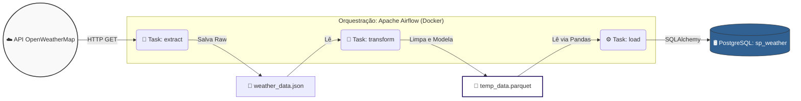

# ⛅ Pipeline de ETL: Clima de São Paulo (OpenWeatherMap)

[](https://www.python.org/)
[]()
[]()
[]()
[]()
[]()
[]()

## 📖 Visão Geral do Projeto

Este projeto é um pipeline de **ETL (Extract, Transform, Load)** desenvolvido para coletar e processar dados climáticos da cidade de São Paulo de forma 100% automatizada. 

O sistema consome a API do **OpenWeatherMap**, realiza a limpeza e desestruturação de dados complexos em JSON usando **Pandas**, armazena temporariamente em formato otimizado **Parquet** e carrega os resultados finais em um banco de dados relacional. Todo o fluxo é orquestrado pelo **Apache Airflow**, com execuções agendadas de hora em hora.

---

## ⚙️ Detalhamento das Etapas do ETL

### 📥 ETAPA 1: Extração (Extract)
**Script:** `src/extract_data.py`

A primeira fase do pipeline é responsável por buscar os dados em tempo real. O script realiza uma requisição HTTP (GET) direcionada à API do OpenWeatherMap. Para garantir a confiabilidade da ingestão, o código valida o *status code* da resposta (esperando um `200 OK`). Em caso de sucesso, o payload (dado bruto) é salvo localmente no diretório `data/weather_data.json`.

**Métricas e dados coletados:**
* Temperaturas (Atual, Mínima, Máxima) e Sensação Térmica.
* Indicadores atmosféricos: Umidade e Pressão.
* Dinâmica do ar: Velocidade e direção do vento, além do nível de nebulosidade.
* Astronomia local: Horários exatos do nascer e pôr do sol.
* Coordenadas geográficas da medição.

### 🔄 ETAPA 2: Transformação (Transform)
**Script:** `src/transform_data.py`

Nesta etapa, o dado bruto em JSON é processado e modelado para uso analítico através de 5 sub-etapas utilizando o `pandas`:

1. **Ingestão e Achatamento:** O arquivo JSON é lido e convertido em um DataFrame. Utiliza-se a função `pd.json_normalize()` para "achatar" (flatten) as estruturas de dados iniciais.
2. **Descompactação da coluna 'Weather':** Como a coluna climática vem estruturada como uma lista de dicionários, o script a desmembra para extrair atributos específicos (`weather_id`, `weather_main`, `weather_description` e `weather_icon`), concatenando-os ao DataFrame principal.
3. **Limpeza de Atributos:** Colunas que não agregam valor analítico ao negócio são descartadas para poupar armazenamento:
   ```python
   columns_to_drop = ['weather', 'weather_icon', 'sys.type']
   ```
4. **Padronização de Nomenclatura:** Chaves complexas ou aninhadas são renomeadas para o padrão inglês claro (ex: `main.temp` torna-se `temperature`, `sys.sunrise` torna-se `sunrise`).
5. **Normalização Temporal:** Tratamento de fuso horário, convertendo timestamps Unix para o formato datetime na *timezone* correta de São Paulo:
   ```python
   columns_to_normalize = ['datetime', 'sunrise', 'sunset']
   # Converte para datetime do fuso horário de São Paulo
   df[col] = pd.to_datetime(df[col], unit='s', utc=True).dt.tz_convert('America/Sao_Paulo')
   ```
*Resultado:* Um DataFrame íntegro, limpo e preparado para o banco de dados.

### 💾 ETAPA 3: Carga (Load)
**Script:** `src/load_data.py`

A etapa final persiste os dados transformados em um Data Warehouse/Data Mart local.

1. **Conexão:** Estabelece comunicação segura com o PostgreSQL utilizando `SQLAlchemy`:
   ```python
   engine = create_engine(f"postgresql+psycopg2://{user}:{password}@{host}:5432/{database}")
   ```
2. **Inserção Histórica:** Os dados são gravados na tabela `sp_weather`. A estratégia de inserção utiliza o parâmetro `if_exists='append'`, garantindo que o pipeline construa um histórico contínuo (série temporal) a cada nova execução, sem sobrescrever o passado.
3. **Auditoria e Validação:** Após o *commit*, o script realiza um `SELECT COUNT(*)` diretamente no banco. Esse total de registros é logado no console, permitindo auditar o crescimento da base e garantir o sucesso da transação.

---

## 🕸️ Fluxo da DAG no Apache Airflow

A DAG `weather_pipeline` foi configurada para rodar **a cada hora** (`0 */1 * * *`) e conta com as seguintes configurações principais:
* `depends_on_past`: False
* `retries`: 2 tentativas (com 5 minutos de intervalo em caso de instabilidade da API)
* `catchup`: False

### 🏗️ Arquitetura do Pipeline



## 📊 Modelagem de Dados

Abaixo estão os principais dados extraídos e processados que compõem a tabela final `sp_weather`:

| Categoria | Colunas |
| :--- | :--- |
| **Identificação** | `city_id`, `city_name`, `country` |
| **Tempo** | `datetime`, `timezone`, `sunrise`, `sunset` |
| **Geolocalização** | `longitude`, `latitude` |
| **Temperatura (°C)** | `temperature`, `feels_like`, `temp_min`, `temp_max` |
| **Condições Atmosféricas** | `pressure`, `humidity`, `sea_level`, `grnd_level` |
| **Vento e Nuvens** | `wind_speed`, `wind_deg`, `wind_gust`, `clouds`, `visibility` |
| **Clima (Descritivo)** | `weather_id`, `weather_main`, `weather_description` |

---

## 🚀 Como Configurar e Executar Localmente

### Pré-requisitos

Antes de começar, você precisará ter as seguintes ferramentas instaladas na sua máquina:

* [Docker e Docker Compose](https://docs.docker.com/get-docker/) para rodar os containers do Airflow e PostgreSQL.
* [Git](https://git-scm.com/downloads) para clonar o repositório.
* Uma conta gratuita no [OpenWeatherMap](https://openweathermap.org/) para obter a chave de acesso (API Key).

---

### 1️⃣ Clone o Repositório

Abra o seu terminal e execute:

```bash
git clone [https://github.com/matheusaraujodata98/pipelines_etl_eng_dados_weather.git](https://github.com/matheusaraujodata98/pipelines_etl_eng_dados_weather.git)
cd pipelines_etl_eng_dados_weather
```

### 2️⃣ Obtenha sua API Key do OpenWeatherMap

1. Acesse o site do [OpenWeatherMap](https://openweathermap.org/).
2. Crie uma conta gratuita.
3. Vá até o seu *Dashboard* e gere uma nova **API Key**.
4. Guarde essa chave, pois você precisará dela no próximo passo.

### 3️⃣ Configure as Variáveis de Ambiente

Crie as pastas necessárias e o arquivo `.env` dentro da pasta `config/`:

```bash
mkdir -p config data
touch config/.env
```

Abra o arquivo `.env` que você acabou de criar e adicione suas credenciais (substitua pelo seu valor real):

```env
# config/.env

# OpenWeatherMap API
API_KEY=sua_chave_api_aqui

# PostgreSQL (para testes locais)
POSTGRES_USER=airflow
POSTGRES_PASSWORD=airflow
POSTGRES_DB=weather_db
```

### 4️⃣ Inicie a Infraestrutura

Com tudo configurado, suba os containers do Airflow e do banco de dados utilizando o Docker Compose:

```bash
docker-compose up -d --build
```

### 5️⃣ Acesse o Airflow

1. Abra o seu navegador e acesse a URL: `http://localhost:8080`
2. Faça o login utilizando as credenciais padrão (geralmente `airflow` para usuário e senha, dependendo do seu docker-compose).
3. Localize a DAG `weather_pipeline`, ative o botão (unpause) e acompanhe a execução automática!

---

*Projeto desenvolvido para fins de estudos voltado para a Engenharia de Dados.*